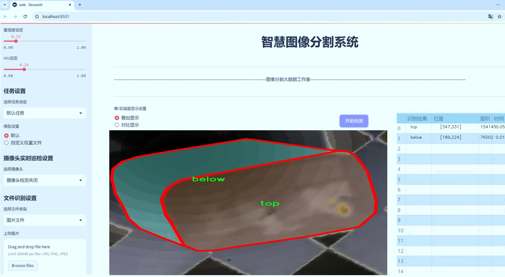
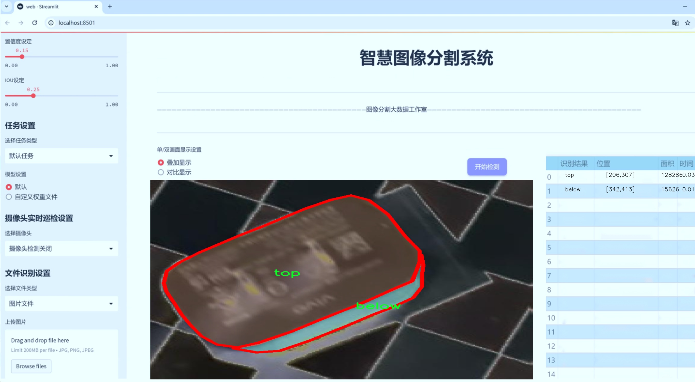
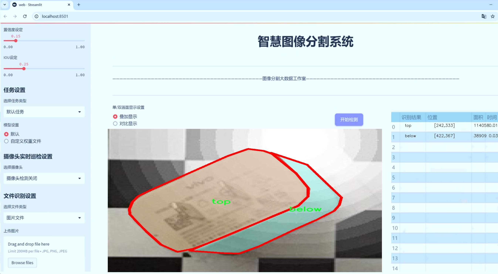
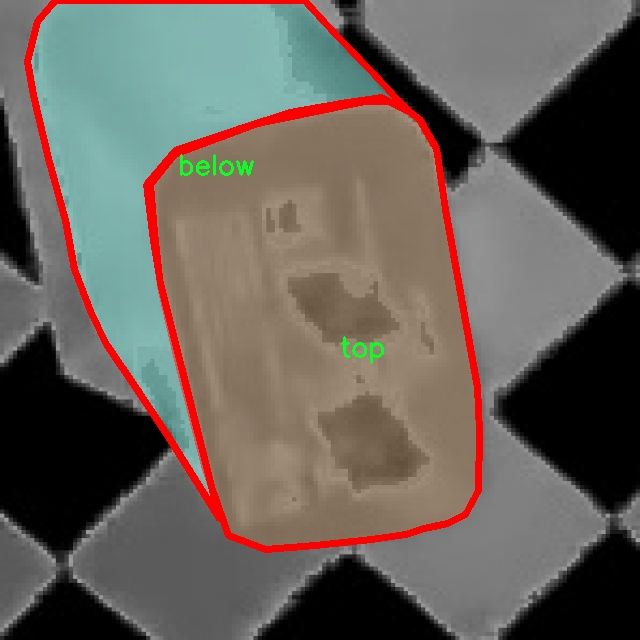
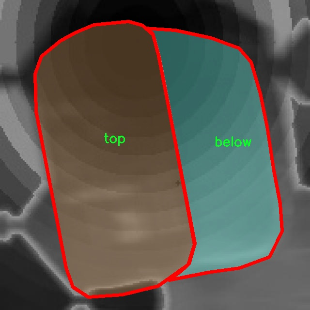
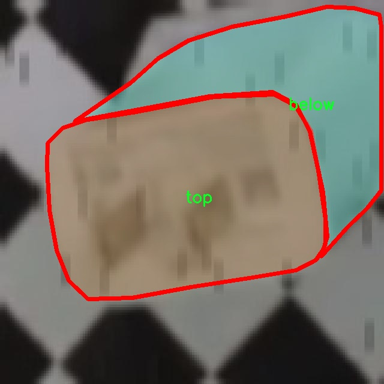
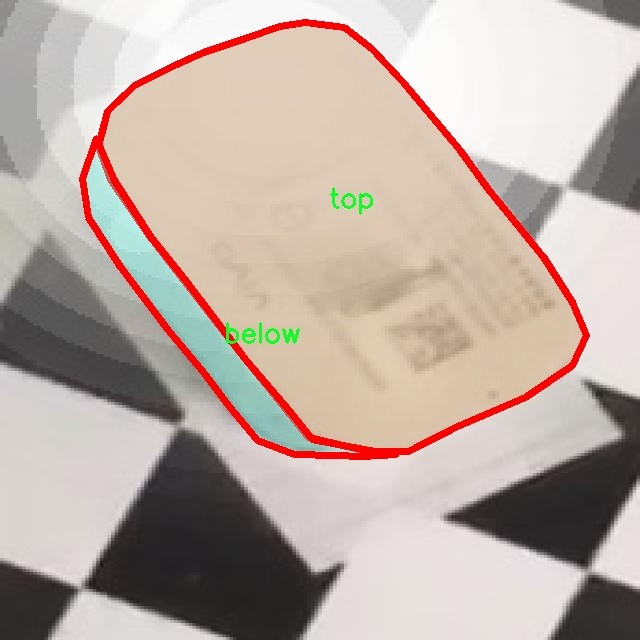
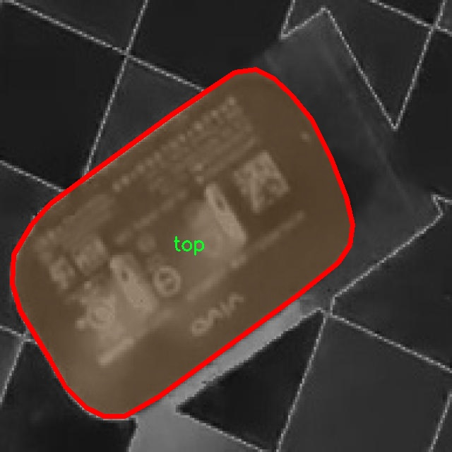

# 充电转换器插头图像分割系统： yolov8-seg-C2f-ODConv

### 1.研究背景与意义

[参考博客](https://gitee.com/YOLOv8_YOLOv11_Segmentation_Studio/projects)

[博客来源](https://kdocs.cn/l/cszuIiCKVNis)

研究背景与意义

随着电动汽车和可再生能源设备的普及，充电转换器插头的使用频率显著增加，如何高效、准确地识别和分割充电转换器插头的图像，成为了计算机视觉领域中的一个重要研究课题。传统的图像处理方法在复杂环境下的表现往往不尽如人意，尤其是在多样化的插头形状、颜色和背景下，容易导致识别率下降。因此，基于深度学习的图像分割技术逐渐成为解决这一问题的有效手段。

YOLO（You Only Look Once）系列模型以其快速和高效的目标检测能力，广泛应用于实时图像处理任务。YOLOv8作为该系列的最新版本，进一步提升了模型的精度和速度，适用于多种复杂场景下的目标检测与分割任务。然而，尽管YOLOv8在目标检测方面表现优异，但在细粒度的图像分割任务中，仍然存在一些挑战，尤其是在处理相似物体或复杂背景时。因此，改进YOLOv8以增强其在充电转换器插头图像分割中的表现，具有重要的研究意义。

本研究将基于4900张图像的数据集，进行充电转换器插头的实例分割。该数据集包含两类目标：插头的底部和顶部，这为模型的训练提供了丰富的样本。通过对数据集的深入分析，我们可以识别出插头在不同环境下的特征，进而为模型的改进提供依据。具体而言，研究将探讨如何通过改进YOLOv8的网络结构、损失函数和数据增强策略，提升模型在实例分割任务中的表现。通过对模型的训练与验证，我们期望能够实现对充电转换器插头的高精度分割，为后续的自动化检测和智能管理提供支持。

此外，充电转换器插头的图像分割技术不仅在电动汽车领域具有广泛的应用前景，还可以推广到其他需要精确识别和分割的领域，如工业自动化、智能家居和机器人视觉等。通过本研究的开展，能够为相关领域的技术发展提供新的思路和方法，推动计算机视觉技术的应用与发展。

综上所述，基于改进YOLOv8的充电转换器插头图像分割系统的研究，不仅具有重要的理论价值，还具备广泛的实际应用前景。通过对充电转换器插头的高效识别与分割，我们能够为智能充电系统的实现奠定基础，促进电动汽车产业的进一步发展，同时也为计算机视觉技术在其他领域的应用提供借鉴。

### 2.图片演示







注意：本项目提供完整的训练源码数据集和训练教程,由于此博客编辑较早,暂不提供权重文件（best.pt）,需要按照6.训练教程进行训练后实现上图效果。

### 3.视频演示

[3.1 视频演示](https://www.bilibili.com/video/BV1YJUKYNEUc/)

### 4.数据集信息

##### 4.1 数据集类别数＆类别名

nc: 2
names: ['below', 'top']


##### 4.2 数据集信息简介

数据集信息展示

在本研究中，我们采用了名为“mcalibsegment”的数据集，以支持改进YOLOv8-seg的充电转换器插头图像分割系统的训练与评估。该数据集专门设计用于充电转换器插头的图像分割任务，具有丰富的标注信息和多样的图像样本，为模型的训练提供了坚实的基础。

“mcalibsegment”数据集包含两个主要类别，分别为“below”和“top”。这两个类别的定义与充电转换器插头的结构特征密切相关。“below”类别通常指的是插头的底部部分，包含了插头与电源连接的接口以及可能的标识信息；而“top”类别则代表插头的顶部部分，通常包括插头的外壳和可能的指示灯或开关。这种细致的类别划分不仅有助于模型在图像分割任务中准确识别不同部分，还能提升后续处理步骤的有效性，如充电状态的监测和故障诊断。

数据集中的图像样本来源广泛，涵盖了不同品牌和型号的充电转换器插头，确保了数据的多样性和代表性。这些图像在不同的光照条件、背景环境和拍摄角度下采集，增强了模型的鲁棒性，使其能够在实际应用中更好地适应各种复杂场景。此外，数据集还包含了精确的像素级标注信息，为模型的训练提供了必要的监督信号。

在数据预处理阶段，我们对“mcalibsegment”数据集进行了多项处理，以提高训练效果。首先，所有图像均经过统一的尺寸调整，以确保输入数据的一致性。其次，针对不同类别的图像样本，我们进行了数据增强操作，包括随机裁剪、旋转、翻转和颜色调整等，以增加训练样本的多样性，降低模型的过拟合风险。这些处理不仅提高了模型的泛化能力，还提升了分割精度。

为了评估模型的性能，我们将“mcalibsegment”数据集划分为训练集和验证集，确保在训练过程中能够有效监控模型的学习进度和效果。通过对验证集的评估，我们能够实时调整模型的超参数和训练策略，以达到最佳的分割效果。

总之，“mcalibsegment”数据集为改进YOLOv8-seg的充电转换器插头图像分割系统提供了重要的支持。其丰富的类别信息、精确的标注数据以及多样的样本来源，使得该数据集在充电转换器插头的图像分割任务中具有重要的应用价值。通过对该数据集的有效利用，我们期望能够显著提升图像分割模型的性能，为充电设备的智能监控和管理提供更加可靠的技术支持。











### 5.项目依赖环境部署教程（零基础手把手教学）

[5.1 环境部署教程链接（零基础手把手教学）](https://www.bilibili.com/video/BV1jG4Ve4E9t/?vd_source=bc9aec86d164b67a7004b996143742dc)


[5.2 安装Python虚拟环境创建和依赖库安装视频教程链接（零基础手把手教学）](https://www.bilibili.com/video/BV1nA4VeYEze/?vd_source=bc9aec86d164b67a7004b996143742dc)

### 6.手把手YOLOV8-seg训练视频教程（零基础手把手教学）

[6.1 手把手YOLOV8-seg训练视频教程（零基础小白有手就能学会）](https://www.bilibili.com/video/BV1cA4VeYETe/?vd_source=bc9aec86d164b67a7004b996143742dc)


按照上面的训练视频教程链接加载项目提供的数据集，运行train.py即可开始训练



     Epoch   gpu_mem       box       obj       cls    labels  img_size
     1/200     0G   0.01576   0.01955  0.007536        22      1280: 100%|██████████| 849/849 [14:42<00:00,  1.04s/it]
               Class     Images     Labels          P          R     mAP@.5 mAP@.5:.95: 100%|██████████| 213/213 [01:14<00:00,  2.87it/s]
                 all       3395      17314      0.994      0.957      0.0957      0.0843

     Epoch   gpu_mem       box       obj       cls    labels  img_size
     2/200     0G   0.01578   0.01923  0.007006        22      1280: 100%|██████████| 849/849 [14:44<00:00,  1.04s/it]
               Class     Images     Labels          P          R     mAP@.5 mAP@.5:.95: 100%|██████████| 213/213 [01:12<00:00,  2.95it/s]
                 all       3395      17314      0.996      0.956      0.0957      0.0845

     Epoch   gpu_mem       box       obj       cls    labels  img_size
     3/200     0G   0.01561    0.0191  0.006895        27      1280: 100%|██████████| 849/849 [10:56<00:00,  1.29it/s]
               Class     Images     Labels          P          R     mAP@.5 mAP@.5:.95: 100%|███████   | 187/213 [00:52<00:00,  4.04it/s]
                 all       3395      17314      0.996      0.957      0.0957      0.0845


### 7.50+种全套YOLOV8-seg创新点加载调参实验视频教程（一键加载写好的改进模型的配置文件）

[7.1 50+种全套YOLOV8-seg创新点加载调参实验视频教程（一键加载写好的改进模型的配置文件）](https://www.bilibili.com/video/BV1Hw4VePEXv/?vd_source=bc9aec86d164b67a7004b996143742dc)

### YOLOV8-seg算法简介

原始YOLOv8-seg算法原理

YOLOv8-seg算法是YOLO系列目标检测模型的最新进展，旨在提供高效且准确的目标检测与分割功能。作为YOLOv8的一个重要变种，YOLOv8-seg在传统的目标检测基础上，增加了对目标实例的分割能力，使其在处理复杂场景时表现得更加出色。YOLOv8-seg的设计理念基于YOLOv5的成功经验，并在此基础上进行了多方面的创新与优化。

首先，YOLOv8-seg的网络结构依然保持了YOLO系列一贯的高效性与灵活性。该模型由输入层、主干网络、特征融合层和检测头组成，形成了一个完整的目标检测与分割框架。输入层负责接收图像数据，并进行必要的预处理，如归一化和数据增强等，以提高模型的鲁棒性。主干网络则采用了轻量化的C2F模块，这一模块通过深度可分离卷积的方式，显著减少了计算量，同时保持了特征提取的有效性。C2F模块的设计灵感来源于YOLOv7的ELAN模块，具有更多的残差连接，能够更好地传递梯度信息，从而提高模型的训练效率。

在特征融合层，YOLOv8-seg引入了特征金字塔网络（FPN）与路径聚合网络（PAN）的结合，形成了一个高效的特征融合机制。FPN通过多尺度特征的提取与融合，使得模型能够在不同尺度上有效地捕捉目标信息，而PAN则进一步增强了特征的传递与聚合能力。为了提升特征融合的效率，YOLOv8-seg还集成了BiFPN网络，利用双向跨尺度连接和加权特征融合的策略，使得模型在处理多尺度特征时更加灵活与高效。

YOLOv8-seg的检测头采用了解耦合结构，将目标分类与定位任务分开处理。这一创新使得模型在处理复杂场景时，能够更准确地识别目标类别与位置。与传统的锚框机制不同，YOLOv8-seg采用了无锚目标检测的方法，进一步简化了模型的设计，并提高了检测精度。在检测头的输出中，模型不仅提供了目标的类别信息，还生成了每个目标的分割掩码，这使得YOLOv8-seg能够实现实例分割的功能。

在训练过程中，YOLOv8-seg采用了一系列先进的数据增强技术，如马赛克增强、混合增强、空间扰动和颜色扰动等。这些增强手段能够有效提高模型的泛化能力，使其在面对不同场景时依然能够保持良好的性能。此外，YOLOv8-seg还引入了动态标签分配策略，确保在训练过程中正负样本的匹配更加合理。这一策略不仅提升了训练效率，还增强了模型对不同类别目标的适应能力。

损失函数的设计也是YOLOv8-seg的一大亮点。该模型使用了变焦损失（Varifocal Loss）作为分类损失，并结合CIoULoss与DFLLoss作为回归损失。这种损失函数的组合能够有效地处理正负样本的不平衡问题，使得模型在训练时更加关注高质量的正样本，从而提升了整体的检测精度。

综上所述，YOLOv8-seg算法通过对网络结构的优化、特征融合机制的改进、检测头的解耦设计以及先进的训练策略，成功地将目标检测与实例分割结合在一起，形成了一个高效、准确且灵活的目标检测与分割解决方案。随着YOLOv8-seg的推出，目标检测领域又一次迎来了新的技术突破，为各类应用场景提供了更为强大的支持。


### 9.系统功能展示（检测对象为举例，实际内容以本项目数据集为准）

图9.1.系统支持检测结果表格显示

  图9.2.系统支持置信度和IOU阈值手动调节

  图9.3.系统支持自定义加载权重文件best.pt(需要你通过步骤5中训练获得)

  图9.4.系统支持摄像头实时识别

  图9.5.系统支持图片识别

  图9.6.系统支持视频识别

  图9.7.系统支持识别结果文件自动保存

  图9.8.系统支持Excel导出检测结果数据


### 10.50+种全套YOLOV8-seg创新点原理讲解（非科班也可以轻松写刊发刊，V11版本正在科研待更新）

#### 10.1 由于篇幅限制，每个创新点的具体原理讲解就不一一展开，具体见下列网址中的创新点对应子项目的技术原理博客网址【Blog】：


[10.1 50+种全套YOLOV8-seg创新点原理讲解链接](https://gitee.com/qunmasj/good)

#### 10.2 部分改进模块原理讲解(完整的改进原理见上图和技术博客链接)【如果此小节的图加载失败可以通过CSDN或者Github搜索该博客的标题访问原始博客，原始博客图片显示正常】

### YOLOv8模型
YOLOv8模型由Ultralytics团队在YOLOv5模型的基础上，吸收了近两年半来经过实际验证的各种改进，于2023年1月提出。与之前的一些YOLO 系列模型想类似，YOLOv8模型也有多种尺寸，下面以YOLOv8n为例，分析 YOLOv8模型的结构和改进点。YOLOv8模型网络结构如
输入图片的部分，由于发现Mosaic数据增强尽管这有助于提升模型的鲁棒性和泛化性，但是，在一定程度上，也会破坏数据的真实分布，使得模型学习到一些不好的信息。所以YOLOv8模型在训练中的最后10个epoch 停止使用Mosaic数据增强。


在网络结构上，首先主干网络的改变不大，主要是将C3模块替换为了C2f模块，该模块的结构在上图中已示出。C2f模块在C3模块的思路基础上，引入了YOLOv7中 ELAN的思路，引入了更多的跳层连接，这有助于该模块获得更丰富的梯度流信息，而且模型的轻量化得到了保证。依然保留了SPPF，效果不变的同时减少了该模块的执行时间。
在颈部网络中，也是将所有的C3模块更改为C2f模块，同时删除了两处上采样之前的卷积连接层。
在头部网络中，采用了YOLOX中使用的解耦头的思路，两条并行的分支分别提取类别和位置特征。由于分类任务更注重于分析特征图中提取到的特征与已输入图片的部分，由于发现 Mosaic数据增强尽管这有助于提升模型的鲁棒性和泛化性，但是，在一定程度上，也会破坏数据的真实分布，使得模型学习到一些不好的信息。所以YOLOv8模型在训练中的最后10个epoch停止使用Mosaic数据增强。
在网络结构上，首先主干网络的改变不大，主要是将C3模块替换为了C2f模块，该模块的结构在上图中已示出。C2f模块在C3模块的思路基础上，引入了YOLOv7中ELAN的思路，引入了更多的跳层连接，这有助于该模块获得更丰富的梯度流信息，而且模型的轻量化得到了保证。依然保留了SPPF，效果不变的同时减少了该模块的执行时间。
在颈部网络中，也是将所有的C3模块更改为C2f模块，同时删除了两处上采样之前的卷积连接层。
在头部网络中，采用了YOLOX中使用的解耦头的思路，两条并行的分支分别提取类别和位置特征。由于分类任务更注重于分析特征图中提取到的特征与已有类别中的哪一种更为相似，而定位任务更关注边界框与真值框的位置关系，并据此对边界框的坐标进行调整。侧重点的不同使得在使用两个检测头时收敛的速度和预测的精度有所提高。而且使用了无锚框结构，直接预测目标的中心，并使用TAL (Task Alignment Learning，任务对齐学习）来区分正负样本，引入了分类分数和IOU的高次幂乘积作为衡量任务对齐程度的指标，认为同时拥有好的定位和分类评价的在分类和定位损失函数中也引入了这项指标。
在模型的检测结果上，YOLOv8模型也取得了较好的成果，图为官方在coCO数据集上 YOLOv8模型的模型尺寸大小和检测的mAP50-95对比图。mAP50-95指的是IOU的值从50%取到95%，步长为5%，然后算在这些IOU下的mAP的均值。图的 a）图展示了YOLOv8在同尺寸下模型中参数没有较大增加的前提下取得了比其他模型更好的精度，图2-17的b)图展示了YOLOv8比其他YOLO系列模型在同尺寸时，推理速度更快且精度没有太大下降。


### 视觉transformer(ViT)简介
视觉transformer(ViT)最近在各种计算机视觉任务中证明了巨大的成功，并受到了相当多的关注。与卷积神经网络(CNNs)相比，ViT具有更强的全局信息捕获能力和远程交互能力，表现出优于CNNs的准确性，特别是在扩大训练数据大小和模型大小时[An image is worth 16x16 words: Transformers for image recognition at scale,Coatnet]。

尽管ViT在低分辨率和高计算领域取得了巨大成功，但在高分辨率和低计算场景下，ViT仍不如cnn。例如，下图(左)比较了COCO数据集上当前基于cnn和基于vit的一级检测器。基于vit的检测器(160G mac)和基于cnn的检测器(6G mac)之间的效率差距超过一个数量级。这阻碍了在边缘设备的实时高分辨率视觉应用程序上部署ViT。


左图:现有的基于vit的一级检测器在实时目标检测方面仍然不如当前基于cnn的一级检测器，需要的计算量多出一个数量级。本文引入了第一个基于vit的实时对象检测器来弥补这一差距。在COCO上，efficientvit的AP比efficientdet高3.8，而mac较低。与YoloX相比，efficient ViT节省67.2%的计算成本，同时提供更高的AP。

中:随着输入分辨率的增加，计算成本呈二次增长，无法有效处理高分辨率的视觉应用。

右图:高分辨率对图像分割很重要。当输入分辨率从1024x2048降低到512x1024时，MobileNetV2的mIoU减少12% (8.5 mIoU)。在不提高分辨率的情况下，只提高模型尺寸是无法缩小性能差距的。

ViT的根本计算瓶颈是softmax注意模块，其计算成本随输入分辨率的增加呈二次增长。例如，如上图(中)所示，随着输入分辨率的增加，vit- small[Pytorch image models. https://github.com/rwightman/ pytorch-image-models]的计算成本迅速显著大于ResNet-152的计算成本。

解决这个问题的一个直接方法是降低输入分辨率。然而，高分辨率的视觉识别在许多现实世界的计算机视觉应用中是必不可少的，如自动驾驶，医疗图像处理等。当输入分辨率降低时，图像中的小物体和精细细节会消失，导致目标检测和语义分割性能显著下降。

上图(右)显示了在cityscape数据集上不同输入分辨率和宽度乘法器下MobileNetV2的性能。例如，将输入分辨率从1024x2048降低到512x1024会使cityscape的性能降低12% (8.5 mIoU)。即使是3.6倍高的mac，只放大模型尺寸而不增加分辨率也无法弥补这一性能损失。

除了降低分辨率外，另一种代表性的方法是限制softmax注意，方法是将其范围限制在固定大小的局部窗口内[Swin transformer,Swin transformer v2]或降低键/值张量的维数[Pyramid vision transformer,Segformer]。然而，它损害了ViT的非局部注意能力，降低了全局接受域(ViT最重要的优点)，使得ViT与大内核cnn的区别更小[A convnet for the 2020s,Scaling up your kernels to 31x31: Revisiting large kernel design in cnns,Lite pose: Efficient architecture design for 2d human pose estimation]。

本文介绍了一个有效的ViT体系结构，以解决这些挑战。发现没有必要坚持softmax注意力。本文建议用线性注意[Transformers are rnns: Fast autoregressive transformers with linear attention]代替softmax注意。

线性注意的关键好处是，它保持了完整的n 2 n^2n 2
 注意映射，就像softmax注意。同时，它利用矩阵乘法的联想特性，避免显式计算完整的注意映射，同时保持相同的功能。因此，它保持了softmax注意力的全局特征提取能力，且计算复杂度仅为线性。线性注意的另一个关键优点是它避免了softmax，这使得它在移动设备上更有效(下图左)。


左图:线性注意比类似mac下的softmax注意快3.3-4.5倍，这是因为去掉了硬件效率不高的softmax功能。延迟是在Qualcomm Snapdragon 855 CPU和TensorFlow-Lite上测量的。本文增加线性注意的头部数量，以确保它具有与softmax注意相似的mac。

中:然而，如果没有softmax注意中使用的非线性注意评分归一化，线性注意无法有效集中其注意分布，削弱了其局部特征提取能力。后文提供了可视化。

右图:本文用深度卷积增强线性注意，以解决线性注意的局限性。深度卷积可以有效地捕捉局部特征，而线性注意可以专注于捕捉全局信息。增强的线性注意在保持线性注意的效率和简单性的同时，表现出在各种视觉任务上的强大表现(图4)。

然而，直接应用线性注意也有缺点。以往的研究表明线性注意和softmax注意之间存在显著的性能差距(下图中间)。


左:高通骁龙855上的精度和延迟权衡。效率vit比效率网快3倍，精度更高。中:ImageNet上softmax注意与线性注意的比较。在相同的计算条件下，本文观察到softmax注意与线性注意之间存在显著的精度差距。而深度卷积增强模型后，线性注意的精度有明显提高。

相比之下，softmax注意的精度变化不大。在相同MAC约束下，增强线性注意比增强软最大注意提高了0.3%的精度。右图:与增强的softmax注意相比，增强的线性注意硬件效率更高，随着分辨率的增加，延迟增长更慢。

深入研究线性注意和softmax注意的详细公式，一个关键的区别是线性注意缺乏非线性注意评分归一化方案。这使得线性注意无法有效地将注意力分布集中在局部模式产生的高注意分数上，从而削弱了其局部特征提取能力。

本文认为这是线性注意的主要限制，使其性能不如softmax注意。本文提出了一个简单而有效的解决方案来解决这一限制，同时保持线性注意在低复杂度和低硬件延迟方面的优势。具体来说，本文建议通过在每个FFN层中插入额外的深度卷积来增强线性注意。因此，本文不需要依赖线性注意进行局部特征提取，避免了线性注意在捕捉局部特征方面的不足，并利用了线性注意在捕捉全局特征方面的优势。

本文广泛评估了efficient vit在低计算预算下对各种视觉任务的有效性，包括COCO对象检测、城市景观语义分割和ImageNet分类。本文想要突出高效的主干设计，所以没有包括任何正交的附加技术(例如，知识蒸馏，神经架构搜索)。尽管如此，在COCO val2017上，efficientvit的AP比efficientdet - d1高2.4倍，同时节省27.9%的计算成本。在cityscape上，efficientvit提供了比SegFormer高2.5个mIoU，同时降低了69.6%的计算成本。在ImageNet上，efficientvit在584M mac上实现了79.7%的top1精度，优于efficientnet - b1的精度，同时节省了16.6%的计算成本。

与现有的以减少参数大小或mac为目标的移动ViT模型[Mobile-former,Mobilevit,NASVit]不同，本文的目标是减少移动设备上的延迟。本文的模型不涉及复杂的依赖或硬件低效操作。因此，本文减少的计算成本可以很容易地转化为移动设备上的延迟减少。

在高通骁龙855 CPU上，efficient vit运行速度比efficientnet快3倍，同时提供更高的ImageNet精度。本文的代码和预训练的模型将在出版后向公众发布。

### Efficient Vision Transformer.
提高ViT的效率对于在资源受限的边缘平台上部署ViT至关重要，如手机、物联网设备等。尽管ViT在高计算区域提供了令人印象深刻的性能，但在针对低计算区域时，它通常不如以前高效的cnn[Efficientnet, mobilenetv3,Once for all: Train one network and specialize it for efficient deployment]。为了缩小差距，MobileViT建议结合CNN和ViT的长处，使用transformer将卷积中的局部处理替换为全局处理。MobileFormer提出了在MobileNet和Transformer之间建立双向桥以实现特征融合的并行化。NASViT提出利用神经架构搜索来搜索高效的ViT架构。

这些模型在ImageNet上提供了极具竞争力的准确性和效率的权衡。然而，它们并不适合高分辨率的视觉任务，因为它们仍然依赖于softmax注意力。


在本节中，本文首先回顾了自然语言处理中的线性注意，并讨论了它的优缺点。接下来，本文介绍了一个简单而有效的解决方案来克服线性注意的局限性。最后，给出了efficient vit的详细架构。

 为可学习投影矩阵。Oi表示矩阵O的第i行。Sim(·，·)为相似度函数。

虽然softmax注意力在视觉和NLP方面非常成功，但它并不是唯一的选择。例如，线性注意提出了如下相似度函数:


其中，φ(·)为核函数。在本工作中，本文选择了ReLU作为内核函数，因为它对硬件来说是友好的。当Sim(Q, K) = φ(Q)φ(K)T时，式(1)可改写为:


线性注意的一个关键优点是，它允许利用矩阵乘法的结合律，在不改变功能的情况下，将计算复杂度从二次型降低到线性型:


除了线性复杂度之外，线性注意的另一个关键优点是它不涉及注意模块中的softmax。Softmax在硬件上效率非常低。避免它可以显著减少延迟。例如，下图(左)显示了softmax注意和线性注意之间的延迟比较。在类似的mac上，线性注意力比移动设备上的softmax注意力要快得多。


#### EfficientViT
Enhancing Linear Attention with Depthwise Convolution

虽然线性注意在计算复杂度和硬件延迟方面优于softmax注意，但线性注意也有局限性。以往的研究[\[Luna: Linear unified nested attention,Random feature attention,Combiner: Full attention transformer with sparse computation cost,cosformer: Rethinking softmax in attention\]](https://afdian.net/item/602b9612927111ee9ec55254001e7c00)表明，在NLP中线性注意和softmax注意之间通常存在显著的性能差距。对于视觉任务，之前的研究[Visual correspondence hallucination,Quadtree attention for vision transformers]也表明线性注意不如softmax注意。在本文的实验中，本文也有类似的观察结果(图中)。


本文对这一假设提出了质疑，认为线性注意的低劣性能主要是由于局部特征提取能力的丧失。如果没有在softmax注意中使用的非线性评分归一化，线性注意很难像softmax注意那样集中其注意分布。下图(中间)提供了这种差异的示例。


在相同的原始注意力得分下，使用softmax比不使用softmax更能集中注意力。因此，线性注意不能有效地聚焦于局部模式产生的高注意分数(下图)，削弱了其局部特征提取能力。


注意图的可视化显示了线性注意的局限性。通过非线性注意归一化，softmax注意可以产生清晰的注意分布，如中间行所示。相比之下，线性注意的分布相对平滑，使得线性注意在捕捉局部细节方面的能力较弱，造成了显著的精度损失。本文通过深度卷积增强线性注意来解决这一限制，并有效提高了准确性。

介绍了一个简单而有效的解决方案来解决这个限制。本文的想法是用卷积增强线性注意，这在局部特征提取中是非常有效的。这样，本文就不需要依赖于线性注意来捕捉局部特征，而可以专注于全局特征提取。具体来说，为了保持线性注意的效率和简单性，本文建议在每个FFN层中插入一个深度卷积，这样计算开销很小，同时极大地提高了线性注意的局部特征提取能力。

#### Building Block

下图(右)展示了增强线性注意的详细架构，它包括一个线性注意层和一个FFN层，在FFN的中间插入深度卷积。


与之前的方法[Swin transformer,Coatnet]不同，本文在efficientvit中没有使用相对位置偏差。相对位置偏差虽然可以改善模型的性能，但它使模型容易受到分辨率变化[Segformer]的影响。多分辨率训练或新分辨率下的测试在检测和分割中很常见。去除相对位置偏差使高效率vit对输入分辨率更加灵活。

与之前低计算CNNs[Mobilenetv2,mobilenetv3]的设计不同，本文为下采样块添加了额外的下采样快捷方式。每个下采样快捷方式由一个平均池和一个1x1卷积组成。在本文的实验中，这些额外的下采样快捷方式可以稳定训练效率，提高性能。

#### Macro Architecture

下图说明了efficientvit的宏观体系结构。它由输入 stem 和4级组成。最近的研究[Coatnet,Levit,Early convolutions help transformers see better]表明在早期阶段使用卷积对ViT更好。本文遵循这个设计，在第三阶段开始使用增强的线性注意。


EfficientViT宏观架构。本文从第三阶段开始使用增强的线性注意。P2、P3和P4形成了一个金字塔特征图，用于检测和分割。P4用于分类。

为了突出高效的主干本身，本文对MBConv和FFN使用相同的扩展比e (e = 4)保持超参数简单，对所有深度卷积使用相同的内核大小k(除了输入stem)，对所有层使用相同的激活函数(hard swish)。

P2、P3和P4表示阶段2、3和4的输出，形成了特征图的金字塔。本文按照惯例将P2、P3和P4送至检测头。本文使用Yolov8进行检测。为了分割，本文融合了P2和P4。融合特征被馈送到一个轻量级头，包括几个卷积层，遵循Fast-SCNN。为了分类，本文将P4输入到轻量级头部，与MobileNetV3相同。


### 11.项目核心源码讲解（再也不用担心看不懂代码逻辑）

#### 11.1 ultralytics\trackers\utils\gmc.py

以下是经过精简和注释的核心代码部分，保留了主要功能并进行了详细的中文注释：

```python
import cv2
import numpy as np
from ultralytics.utils import LOGGER

class GMC:
    """
    通用运动补偿 (GMC) 类，用于视频帧中的跟踪和物体检测。

    属性:
        method (str): 使用的跟踪方法，选项包括 'orb', 'sift', 'ecc', 'sparseOptFlow', 'none'。
        downscale (int): 处理时图像的缩放因子。
        prevFrame (np.array): 存储前一帧图像以进行跟踪。
        prevKeyPoints (list): 存储前一帧的关键点。
        prevDescriptors (np.array): 存储前一帧的描述符。
        initializedFirstFrame (bool): 标志，指示是否已处理第一帧。

    方法:
        __init__(self, method='sparseOptFlow', downscale=2): 初始化 GMC 对象。
        apply(self, raw_frame, detections=None): 在原始帧上应用指定的方法。
    """

    def __init__(self, method='sparseOptFlow', downscale=2):
        """初始化视频跟踪器，设置跟踪方法和缩放因子。"""
        self.method = method
        self.downscale = max(1, int(downscale))  # 确保缩放因子至少为1

        # 根据选择的方法初始化检测器、提取器和匹配器
        if self.method == 'orb':
            self.detector = cv2.FastFeatureDetector_create(20)
            self.extractor = cv2.ORB_create()
            self.matcher = cv2.BFMatcher(cv2.NORM_HAMMING)
        elif self.method == 'sift':
            self.detector = cv2.SIFT_create()
            self.extractor = cv2.SIFT_create()
            self.matcher = cv2.BFMatcher(cv2.NORM_L2)
        elif self.method == 'ecc':
            self.warp_mode = cv2.MOTION_EUCLIDEAN
            self.criteria = (cv2.TERM_CRITERIA_EPS | cv2.TERM_CRITERIA_COUNT, 5000, 1e-6)
        elif self.method == 'sparseOptFlow':
            self.feature_params = dict(maxCorners=1000, qualityLevel=0.01, minDistance=1, blockSize=3)
        elif self.method in ['none', 'None', None]:
            self.method = None
        else:
            raise ValueError(f'错误: 未知的 GMC 方法: {method}')

        # 初始化变量
        self.prevFrame = None
        self.prevKeyPoints = None
        self.prevDescriptors = None
        self.initializedFirstFrame = False

    def apply(self, raw_frame, detections=None):
        """根据指定的方法在原始帧上应用物体检测。"""
        if self.method in ['orb', 'sift']:
            return self.applyFeatures(raw_frame, detections)
        elif self.method == 'ecc':
            return self.applyEcc(raw_frame, detections)
        elif self.method == 'sparseOptFlow':
            return self.applySparseOptFlow(raw_frame, detections)
        else:
            return np.eye(2, 3)  # 返回单位矩阵

    def applyEcc(self, raw_frame, detections=None):
        """应用ECC算法进行图像配准。"""
        height, width, _ = raw_frame.shape
        frame = cv2.cvtColor(raw_frame, cv2.COLOR_BGR2GRAY)  # 转换为灰度图
        H = np.eye(2, 3, dtype=np.float32)  # 初始化变换矩阵

        # 图像下采样
        if self.downscale > 1.0:
            frame = cv2.resize(frame, (width // self.downscale, height // self.downscale))

        # 处理第一帧
        if not self.initializedFirstFrame:
            self.prevFrame = frame.copy()  # 保存当前帧
            self.initializedFirstFrame = True
            return H

        # 运行ECC算法
        try:
            (cc, H) = cv2.findTransformECC(self.prevFrame, frame, H, self.warp_mode, self.criteria)
        except Exception as e:
            LOGGER.warning(f'警告: 变换失败，使用单位矩阵 {e}')

        return H

    def applyFeatures(self, raw_frame, detections=None):
        """应用特征检测方法（如ORB或SIFT）。"""
        height, width, _ = raw_frame.shape
        frame = cv2.cvtColor(raw_frame, cv2.COLOR_BGR2GRAY)  # 转换为灰度图
        H = np.eye(2, 3)

        # 图像下采样
        if self.downscale > 1.0:
            frame = cv2.resize(frame, (width // self.downscale, height // self.downscale))

        # 检测关键点
        keypoints = self.detector.detect(frame)

        # 处理第一帧
        if not self.initializedFirstFrame:
            self.prevFrame = frame.copy()
            self.prevKeyPoints = keypoints
            self.prevDescriptors = self.extractor.compute(frame, keypoints)[1]
            self.initializedFirstFrame = True
            return H

        # 匹配描述符
        knnMatches = self.matcher.knnMatch(self.prevDescriptors, self.extractor.compute(frame, keypoints)[1], 2)
        goodMatches = [m for m, n in knnMatches if m.distance < 0.9 * n.distance]

        # 计算变换矩阵
        if len(goodMatches) > 4:
            prevPoints = np.array([self.prevKeyPoints[m.queryIdx].pt for m in goodMatches])
            currPoints = np.array([keypoints[m.trainIdx].pt for m in goodMatches])
            H, _ = cv2.estimateAffinePartial2D(prevPoints, currPoints, cv2.RANSAC)

        # 更新状态
        self.prevFrame = frame.copy()
        self.prevKeyPoints = keypoints
        self.prevDescriptors = self.extractor.compute(frame, keypoints)[1]

        return H

    def applySparseOptFlow(self, raw_frame, detections=None):
        """应用稀疏光流法进行跟踪。"""
        height, width, _ = raw_frame.shape
        frame = cv2.cvtColor(raw_frame, cv2.COLOR_BGR2GRAY)
        H = np.eye(2, 3)

        # 图像下采样
        if self.downscale > 1.0:
            frame = cv2.resize(frame, (width // self.downscale, height // self.downscale))

        # 检测关键点
        keypoints = cv2.goodFeaturesToTrack(frame, mask=None, **self.feature_params)

        # 处理第一帧
        if not self.initializedFirstFrame:
            self.prevFrame = frame.copy()
            self.prevKeyPoints = keypoints
            self.initializedFirstFrame = True
            return H

        # 计算光流
        matchedKeypoints, status, _ = cv2.calcOpticalFlowPyrLK(self.prevFrame, frame, self.prevKeyPoints, None)

        # 选择有效的匹配点
        prevPoints = np.array([self.prevKeyPoints[i] for i in range(len(status)) if status[i]])
        currPoints = np.array([matchedKeypoints[i] for i in range(len(status)) if status[i]])

        # 计算变换矩阵
        if len(prevPoints) > 4:
            H, _ = cv2.estimateAffinePartial2D(prevPoints, currPoints, cv2.RANSAC)

        # 更新状态
        self.prevFrame = frame.copy()
        self.prevKeyPoints = keypoints

        return H
```

### 代码说明：
1. **类 GMC**: 该类实现了多种运动补偿算法，支持不同的跟踪方法（如ORB、SIFT、ECC和稀疏光流）。
2. **初始化方法**: 根据选择的跟踪方法初始化相应的检测器、提取器和匹配器。
3. **apply 方法**: 根据指定的方法在原始帧上应用物体检测。
4. **applyEcc 方法**: 实现了ECC算法进行图像配准。
5. **applyFeatures 方法**: 实现了特征检测和描述符匹配。
6. **applySparseOptFlow 方法**: 实现了稀疏光流法进行跟踪。

这些方法通过对视频帧的处理，能够有效地跟踪和检测物体。

这个文件定义了一个名为 `GMC` 的类，主要用于视频帧中的目标跟踪和检测。该类实现了多种跟踪算法，包括 ORB、SIFT、ECC 和稀疏光流（Sparse Optical Flow），并支持对帧进行下采样以提高计算效率。

在 `GMC` 类的构造函数中，用户可以指定跟踪方法和下采样因子。支持的跟踪方法包括 'orb'、'sift'、'ecc'、'sparseOptFlow' 和 'none'。根据所选的方法，类会初始化相应的特征检测器、描述符提取器和匹配器。例如，使用 ORB 方法时，会创建一个快速特征检测器和一个 ORB 描述符提取器；而使用 SIFT 方法时，则会创建 SIFT 特征检测器和描述符提取器。

类中有多个方法来处理视频帧。`apply` 方法是主要的接口，根据当前设置的跟踪方法调用相应的处理函数。具体的处理方法包括 `applyEcc`、`applyFeatures` 和 `applySparseOptFlow`，分别对应 ECC 算法、特征基方法（如 ORB 和 SIFT）和稀疏光流方法。

在 `applyEcc` 方法中，首先将输入帧转换为灰度图像，并根据下采样因子对图像进行处理。若是第一次处理帧，则会初始化前一帧数据。否则，使用 OpenCV 的 `findTransformECC` 函数计算当前帧与前一帧之间的变换矩阵。

`applyFeatures` 方法同样会将输入帧转换为灰度图像，并在处理过程中检测关键点和计算描述符。它使用 KNN 匹配器来匹配前一帧和当前帧的描述符，并通过 RANSAC 算法估计刚性变换矩阵。

`applySparseOptFlow` 方法使用稀疏光流来跟踪关键点。它首先检测关键点，然后计算前一帧和当前帧之间的光流，并提取匹配的关键点，最后估计变换矩阵。

该类还包含一些属性，用于存储前一帧、前一帧的关键点和描述符，以及一个标志位以指示是否已处理第一帧。这些功能使得 `GMC` 类在视频处理和计算机视觉任务中非常有用，能够有效地跟踪移动物体并进行相应的处理。

#### 11.2 ultralytics\utils\loss.py

以下是经过简化和注释的核心代码部分，主要集中在损失计算类的实现上。注释详细解释了每个类和方法的功能及其实现细节。

```python
import torch
import torch.nn as nn
import torch.nn.functional as F

class BboxLoss(nn.Module):
    def __init__(self, reg_max, use_dfl=False):
        """初始化边界框损失类，设置最大正则化值和是否使用DFL（分布焦点损失）。"""
        super().__init__()
        self.reg_max = reg_max  # 最大正则化值
        self.use_dfl = use_dfl  # 是否使用分布焦点损失
        self.iou_ratio = 0.5  # IoU比率

    def forward(self, pred_dist, pred_bboxes, anchor_points, target_bboxes, target_scores, target_scores_sum, fg_mask):
        """计算IoU损失和DFL损失。"""
        weight = target_scores.sum(-1)[fg_mask].unsqueeze(-1)  # 权重为目标分数的总和
        iou = bbox_iou(pred_bboxes[fg_mask], target_bboxes[fg_mask], xywh=False, CIoU=True)  # 计算IoU
        loss_iou = ((1.0 - iou) * weight).sum() / target_scores_sum  # IoU损失

        # DFL损失计算
        if self.use_dfl:
            target_ltrb = bbox2dist(anchor_points, target_bboxes, self.reg_max)  # 将目标边界框转换为分布格式
            loss_dfl = self._df_loss(pred_dist[fg_mask].view(-1, self.reg_max + 1), target_ltrb[fg_mask]) * weight
            loss_dfl = loss_dfl.sum() / target_scores_sum  # DFL损失
        else:
            loss_dfl = torch.tensor(0.0).to(pred_dist.device)  # 如果不使用DFL，损失为0

        return loss_iou, loss_dfl  # 返回IoU损失和DFL损失

    @staticmethod
    def _df_loss(pred_dist, target):
        """计算分布焦点损失。"""
        tl = target.long()  # 目标左边界
        tr = tl + 1  # 目标右边界
        wl = tr - target  # 左边权重
        wr = 1 - wl  # 右边权重
        # 计算左边和右边的交叉熵损失
        return (F.cross_entropy(pred_dist, tl.view(-1), reduction='none').view(tl.shape) * wl +
                F.cross_entropy(pred_dist, tr.view(-1), reduction='none').view(tl.shape) * wr).mean(-1, keepdim=True)

class v8DetectionLoss:
    """检测损失类，计算边界框、分类和DFL损失。"""

    def __init__(self, model):
        """初始化检测损失类，设置模型相关属性和损失函数。"""
        device = next(model.parameters()).device  # 获取模型设备
        m = model.model[-1]  # 获取检测模块
        self.bce = nn.BCEWithLogitsLoss(reduction='none')  # 二元交叉熵损失
        self.bbox_loss = BboxLoss(m.reg_max - 1, use_dfl=m.reg_max > 1).to(device)  # 边界框损失实例
        self.device = device  # 设备信息

    def __call__(self, preds, batch):
        """计算损失并返回总损失和分离的损失。"""
        loss = torch.zeros(3, device=self.device)  # 初始化损失向量
        pred_scores = preds[1]  # 获取预测分数
        pred_bboxes = preds[0]  # 获取预测边界框

        # 计算目标分数和边界框
        target_scores = batch['target_scores'].to(self.device)
        target_bboxes = batch['target_bboxes'].to(self.device)

        # 计算边界框损失
        loss[0], loss[1] = self.bbox_loss(pred_bboxes, target_bboxes, target_scores)  # 计算边界框损失

        # 计算分类损失
        loss[2] = self.bce(pred_scores, target_scores).sum() / max(target_scores.sum(), 1)  # 分类损失

        return loss.sum(), loss.detach()  # 返回总损失和分离的损失
```

### 代码说明
1. **BboxLoss类**：用于计算边界框的损失，包括IoU损失和可选的分布焦点损失（DFL）。
   - `forward`方法：计算IoU损失和DFL损失。
   - `_df_loss`方法：计算DFL损失。

2. **v8DetectionLoss类**：用于计算检测任务的总损失，包括边界框损失和分类损失。
   - `__call__`方法：接受预测和目标数据，计算并返回总损失。

以上代码展示了YOLO模型中的损失计算机制，重点在于如何通过不同的损失函数来优化模型的性能。

这个程序文件`ultralytics/utils/loss.py`主要实现了YOLO（You Only Look Once）模型中的各种损失函数，用于目标检测、分割和关键点检测等任务。文件中定义了多个类，每个类实现了特定的损失计算方法，以便在训练过程中评估模型的性能。

首先，`SlideLoss`类和`EMASlideLoss`类是针对滑动损失的实现。`SlideLoss`通过对每个元素应用损失函数，计算出加权损失，权重根据预测与真实值之间的IoU（Intersection over Union）值进行调整。`EMASlideLoss`则在此基础上引入了指数移动平均（EMA）来动态调整IoU的值，从而更好地适应训练过程中的变化。

接下来，`VarifocalLoss`和`FocalLoss`类实现了变焦损失和焦点损失。`VarifocalLoss`通过调整权重来处理类别不平衡问题，特别是在目标检测中，常常会出现正负样本不均衡的情况。`FocalLoss`则通过对预测概率进行调制，强调难以分类的样本，从而提高模型的鲁棒性。

`BboxLoss`类实现了边界框损失的计算，结合了IoU损失和分布焦点损失（DFL）。该类通过计算预测边界框与真实边界框之间的IoU来评估模型的定位精度，同时可以选择是否使用DFL来进一步提高定位的准确性。

`KeypointLoss`类专门用于计算关键点检测的损失。它通过计算预测关键点与真实关键点之间的欧几里得距离来评估模型的性能，并根据目标区域的大小进行归一化处理。

`v8DetectionLoss`类是一个综合性的损失计算类，结合了上述损失函数，负责计算目标检测任务中的总损失。它处理输入的预测结果和真实标签，计算边界框损失、分类损失等，并返回加权后的总损失。

`v8SegmentationLoss`和`v8PoseLoss`类分别用于分割和姿态估计任务，继承自`v8DetectionLoss`，并在此基础上增加了特定于任务的损失计算逻辑。例如，`v8SegmentationLoss`类计算分割损失时，会考虑掩码的重叠情况，而`v8PoseLoss`类则计算关键点的损失和可见性损失。

最后，`v8ClassificationLoss`类用于计算分类任务的损失，使用交叉熵损失函数来评估预测类别与真实类别之间的差异。

整体来看，这个文件提供了一系列灵活且高效的损失函数实现，旨在提升YOLO模型在不同任务中的表现，确保模型能够在训练过程中有效地学习和优化。

#### 11.3 ultralytics\models\fastsam\__init__.py

以下是代码中最核心的部分，并附上详细的中文注释：

```python
# 导入必要的模块和类
from .model import FastSAM  # 从当前包的model模块导入FastSAM类
from .predict import FastSAMPredictor  # 从当前包的predict模块导入FastSAMPredictor类
from .prompt import FastSAMPrompt  # 从当前包的prompt模块导入FastSAMPrompt类
from .val import FastSAMValidator  # 从当前包的val模块导入FastSAMValidator类

# 定义该模块的公共接口，只有这些类可以被外部访问
__all__ = 'FastSAMPredictor', 'FastSAM', 'FastSAMPrompt', 'FastSAMValidator'
```

### 代码详细注释：

1. **模块导入**：
   - `from .model import FastSAM`：从当前包的 `model` 模块中导入 `FastSAM` 类，这个类可能是模型的核心实现。
   - `from .predict import FastSAMPredictor`：从 `predict` 模块中导入 `FastSAMPredictor` 类，负责模型的预测功能。
   - `from .prompt import FastSAMPrompt`：从 `prompt` 模块中导入 `FastSAMPrompt` 类，可能用于处理用户输入或提示信息。
   - `from .val import FastSAMValidator`：从 `val` 模块中导入 `FastSAMValidator` 类，负责模型的验证过程。

2. **公共接口定义**：
   - `__all__` 变量用于定义该模块的公共接口，只有在使用 `from module import *` 时，列出的类会被导入。这有助于控制模块的可见性和使用方式，避免外部代码访问不必要的内部实现。

这个程序文件是一个Python模块的初始化文件，位于`ultralytics/models/fastsam`目录下。文件的主要功能是导入和定义该模块中可用的类和函数，以便其他模块可以方便地使用。

首先，文件开头的注释部分提到这是Ultralytics YOLO项目的一部分，并且遵循AGPL-3.0许可证。这表明该项目是开源的，用户可以自由使用和修改，但需要遵循相应的许可证条款。

接下来，文件通过`from ... import ...`语句导入了四个主要的组件：`FastSAM`、`FastSAMPredictor`、`FastSAMPrompt`和`FastSAMValidator`。这些组件分别可能代表了该模块的核心功能，包括模型定义、预测器、提示功能和验证器。

最后，`__all__`变量被定义为一个包含字符串的元组，列出了模块中公开的接口。这意味着当使用`from ultralytics.models.fastsam import *`这样的语句时，只会导入`FastSAMPredictor`、`FastSAM`、`FastSAMPrompt`和`FastSAMValidator`这四个组件，而不会导入其他未列出的内容。这种做法有助于控制模块的公共接口，避免不必要的命名冲突和提高代码的可读性。

总的来说，这个初始化文件为`fastsam`模块提供了一个清晰的接口，使得其他模块能够方便地访问和使用其核心功能。

#### 11.4 ultralytics\models\yolo\segment\predict.py

以下是代码中最核心的部分，并附上详细的中文注释：

```python
from ultralytics.engine.results import Results  # 导入结果处理类
from ultralytics.models.yolo.detect.predict import DetectionPredictor  # 导入检测预测器基类
from ultralytics.utils import DEFAULT_CFG, ops  # 导入默认配置和操作工具

class SegmentationPredictor(DetectionPredictor):
    """
    扩展DetectionPredictor类的分割预测器类。
    该类用于基于分割模型进行预测。
    """

    def __init__(self, cfg=DEFAULT_CFG, overrides=None, _callbacks=None):
        """初始化SegmentationPredictor，使用提供的配置、覆盖参数和回调函数。"""
        super().__init__(cfg, overrides, _callbacks)  # 调用父类构造函数
        self.args.task = 'segment'  # 设置任务类型为分割

    def postprocess(self, preds, img, orig_imgs):
        """对每个输入图像的预测结果进行后处理，包括非极大值抑制和掩膜处理。"""
        # 应用非极大值抑制，过滤掉重叠的检测框
        p = ops.non_max_suppression(preds[0],
                                    self.args.conf,  # 置信度阈值
                                    self.args.iou,  # IOU阈值
                                    agnostic=self.args.agnostic_nms,  # 是否类别无关的NMS
                                    max_det=self.args.max_det,  # 最大检测框数量
                                    nc=len(self.model.names),  # 类别数量
                                    classes=self.args.classes)  # 需要检测的类别

        # 如果输入图像不是列表，则将其转换为numpy数组
        if not isinstance(orig_imgs, list):
            orig_imgs = ops.convert_torch2numpy_batch(orig_imgs)

        results = []  # 存储结果的列表
        proto = preds[1][-1] if len(preds[1]) == 3 else preds[1]  # 获取掩膜原型

        # 遍历每个预测结果
        for i, pred in enumerate(p):
            orig_img = orig_imgs[i]  # 获取原始图像
            img_path = self.batch[0][i]  # 获取图像路径

            if not len(pred):  # 如果没有检测到目标
                masks = None  # 掩膜为空
            elif self.args.retina_masks:  # 如果使用Retina掩膜
                # 将检测框坐标缩放到原始图像尺寸
                pred[:, :4] = ops.scale_boxes(img.shape[2:], pred[:, :4], orig_img.shape)
                # 处理掩膜
                masks = ops.process_mask_native(proto[i], pred[:, 6:], pred[:, :4], orig_img.shape[:2])  # HWC
            else:  # 否则使用普通掩膜处理
                masks = ops.process_mask(proto[i], pred[:, 6:], pred[:, :4], img.shape[2:], upsample=True)  # HWC
                # 同样缩放检测框坐标
                pred[:, :4] = ops.scale_boxes(img.shape[2:], pred[:, :4], orig_img.shape)

            # 将结果存储到Results对象中
            results.append(Results(orig_img, path=img_path, names=self.model.names, boxes=pred[:, :6], masks=masks))
        
        return results  # 返回处理后的结果列表
```

### 代码说明：
1. **导入模块**：导入必要的类和工具函数。
2. **SegmentationPredictor类**：继承自`DetectionPredictor`，用于实现分割任务的预测。
3. **初始化方法**：设置任务类型为分割，并调用父类的初始化方法。
4. **后处理方法**：对模型的预测结果进行处理，包括非极大值抑制、坐标缩放和掩膜处理，最终返回处理后的结果。

这个程序文件是一个用于图像分割的预测类，名为 `SegmentationPredictor`，它继承自 `DetectionPredictor` 类。该类的主要功能是基于分割模型进行图像的预测。

在文件的开头，首先导入了一些必要的模块和类，包括 `Results`、`DetectionPredictor` 和一些工具函数 `ops`。这些导入为后续的功能实现提供了基础。

`SegmentationPredictor` 类的构造函数 `__init__` 接受三个参数：配置 `cfg`、覆盖参数 `overrides` 和回调 `_callbacks`。它调用了父类的构造函数，并将任务类型设置为 'segment'，这表明该类专注于图像分割任务。

类中最重要的方法是 `postprocess`，该方法用于对模型的预测结果进行后处理。它接受三个参数：`preds`（模型的预测结果）、`img`（输入图像）和 `orig_imgs`（原始图像）。在这个方法中，首先通过非极大值抑制（NMS）来过滤掉冗余的检测框，以提高检测的准确性。NMS 的参数包括置信度阈值、IOU 阈值、是否使用无关类别的 NMS 以及最大检测数量等。

接下来，方法检查输入的原始图像是否为列表，如果不是，则将其转换为 NumPy 数组。然后，方法提取预测结果中的掩码信息，并根据不同的条件处理掩码。具体来说，如果设置了 `retina_masks`，则会使用原生掩码处理函数；否则，使用标准的掩码处理函数，并进行必要的上采样。

最后，方法将处理后的结果存储在 `results` 列表中，每个结果都包含原始图像、图像路径、类别名称、检测框和掩码信息。最终，该方法返回处理后的结果列表。

总体而言，这个文件实现了一个用于图像分割的预测器，能够有效地处理输入图像并返回相应的分割结果。通过结合检测和分割的功能，它为用户提供了强大的图像分析能力。

#### 11.5 ultralytics\utils\callbacks\mlflow.py

以下是代码中最核心的部分，并附上详细的中文注释：

```python
from ultralytics.utils import LOGGER, RUNS_DIR, SETTINGS, TESTS_RUNNING, colorstr

try:
    import os

    # 确保在测试环境中不记录日志
    assert not TESTS_RUNNING or 'test_mlflow' in os.environ.get('PYTEST_CURRENT_TEST', '')
    # 确保已启用MLflow集成
    assert SETTINGS['mlflow'] is True  
    import mlflow

    # 确保mlflow模块已正确导入
    assert hasattr(mlflow, '__version__')  
    from pathlib import Path
    PREFIX = colorstr('MLflow: ')  # 设置日志前缀

except (ImportError, AssertionError):
    mlflow = None  # 如果导入失败，则将mlflow设置为None


def on_pretrain_routine_end(trainer):
    """
    在预训练例程结束时记录训练参数到MLflow。

    该函数根据环境变量和训练器参数设置MLflow日志记录。它设置跟踪URI、实验名称和运行名称，
    然后在未激活的情况下启动MLflow运行。最后记录训练器的参数。

    参数:
        trainer (ultralytics.engine.trainer.BaseTrainer): 包含要记录的参数和参数的训练对象。

    全局变量:
        mlflow: 用于记录的mlflow模块。

    环境变量:
        MLFLOW_TRACKING_URI: MLflow跟踪的URI。如果未设置，默认为'runs/mlflow'。
        MLFLOW_EXPERIMENT_NAME: MLflow实验的名称。如果未设置，默认为trainer.args.project。
        MLFLOW_RUN: MLflow运行的名称。如果未设置，默认为trainer.args.name。
    """
    global mlflow

    # 获取跟踪URI，默认为'runs/mlflow'
    uri = os.environ.get('MLFLOW_TRACKING_URI') or str(RUNS_DIR / 'mlflow')
    LOGGER.debug(f'{PREFIX} tracking uri: {uri}')
    mlflow.set_tracking_uri(uri)

    # 设置实验和运行名称
    experiment_name = os.environ.get('MLFLOW_EXPERIMENT_NAME') or trainer.args.project or '/Shared/YOLOv8'
    run_name = os.environ.get('MLFLOW_RUN') or trainer.args.name
    mlflow.set_experiment(experiment_name)

    mlflow.autolog()  # 启用自动日志记录
    try:
        # 开始一个新的MLflow运行
        active_run = mlflow.active_run() or mlflow.start_run(run_name=run_name)
        LOGGER.info(f'{PREFIX}logging run_id({active_run.info.run_id}) to {uri}')
        if Path(uri).is_dir():
            LOGGER.info(f"{PREFIX}view at http://127.0.0.1:5000 with 'mlflow server --backend-store-uri {uri}'")
        LOGGER.info(f"{PREFIX}disable with 'yolo settings mlflow=False'")
        mlflow.log_params(dict(trainer.args))  # 记录训练参数
    except Exception as e:
        LOGGER.warning(f'{PREFIX}WARNING ⚠️ Failed to initialize: {e}\n'
                       f'{PREFIX}WARNING ⚠️ Not tracking this run')


def on_fit_epoch_end(trainer):
    """在每个训练周期结束时记录训练指标到MLflow。"""
    if mlflow:
        # 清理指标名称并记录指标
        sanitized_metrics = {k.replace('(', '').replace(')', ''): float(v) for k, v in trainer.metrics.items()}
        mlflow.log_metrics(metrics=sanitized_metrics, step=trainer.epoch)


def on_train_end(trainer):
    """在训练结束时记录模型工件。"""
    if mlflow:
        # 记录最佳模型及其相关文件
        mlflow.log_artifact(str(trainer.best.parent))  # 记录保存目录
        for f in trainer.save_dir.glob('*'):  # 记录保存目录中的所有文件
            if f.suffix in {'.png', '.jpg', '.csv', '.pt', '.yaml'}:
                mlflow.log_artifact(str(f))

        mlflow.end_run()  # 结束当前运行
        LOGGER.info(f'{PREFIX}results logged to {mlflow.get_tracking_uri()}\n'
                    f"{PREFIX}disable with 'yolo settings mlflow=False'")


# 定义回调函数字典，仅在mlflow可用时
callbacks = {
    'on_pretrain_routine_end': on_pretrain_routine_end,
    'on_fit_epoch_end': on_fit_epoch_end,
    'on_train_end': on_train_end} if mlflow else {}
```

### 代码核心部分说明：
1. **导入模块**：导入必要的模块和库，包括`os`和`mlflow`，并进行基本的错误处理。
2. **`on_pretrain_routine_end`函数**：在预训练结束时记录训练参数，包括设置跟踪URI、实验名称和运行名称。
3. **`on_fit_epoch_end`函数**：在每个训练周期结束时记录训练指标。
4. **`on_train_end`函数**：在训练结束时记录模型的相关文件和工件，并结束当前的MLflow运行。
5. **回调函数字典**：根据是否成功导入`mlflow`来定义回调函数，以便在训练过程中进行相应的日志记录。

这个程序文件是用于在Ultralytics YOLO模型训练过程中集成MLflow日志记录的模块。MLflow是一个开源平台，用于管理机器学习生命周期，包括实验跟踪、模型管理和部署等功能。该模块的主要功能是记录训练过程中的参数、指标和模型工件，以便后续分析和复现。

文件的开头部分包含了一些注释，说明了该模块的功能和使用方法。用户可以通过设置环境变量来配置项目名称、运行名称和跟踪URI等信息。此外，文件中还提供了启动本地MLflow服务器和终止运行中的MLflow服务器实例的命令。

接下来，文件导入了一些必要的库和模块，包括Ultralytics的日志记录器、运行目录、设置和测试状态等。它尝试导入MLflow库，并进行了一些基本的检查，以确保MLflow库已正确安装且集成已启用。

在函数部分，定义了三个主要的回调函数：

1. **on_pretrain_routine_end**：该函数在预训练例程结束时被调用，用于记录训练参数。它根据环境变量和训练器的参数设置MLflow的跟踪URI、实验名称和运行名称，并启动MLflow运行。然后，它将训练器的参数记录到MLflow中。

2. **on_fit_epoch_end**：该函数在每个训练周期结束时被调用，用于记录训练指标。它将训练器的指标进行清洗，去掉括号，并将其记录到MLflow中。

3. **on_train_end**：该函数在训练结束时被调用，用于记录模型工件。它将最佳模型和其他相关文件（如图像、CSV、YAML等）记录到MLflow中，并结束当前的MLflow运行。

最后，文件创建了一个回调字典，只有在成功导入MLflow的情况下，才会包含上述三个回调函数。这使得在训练过程中可以灵活地记录相关信息，便于后续的模型管理和分析。整体来看，这个模块为Ultralytics YOLO提供了强大的日志记录功能，帮助用户更好地管理和追踪他们的机器学习实验。

### 12.系统整体结构（节选）

### 整体功能和构架概括

Ultralytics项目是一个用于目标检测和图像分割的开源框架，主要基于YOLO（You Only Look Once）模型。该项目的整体架构包括多个模块，分别负责不同的功能，如目标跟踪、损失计算、模型预测和实验管理等。每个模块通过定义特定的类和函数来实现其功能，便于在训练和推理过程中进行调用和扩展。

- **目标跟踪**：通过`gmc.py`实现了多种跟踪算法，支持在视频帧中检测和跟踪目标。
- **损失计算**：`loss.py`实现了多种损失函数，支持目标检测、分割和关键点检测任务，帮助模型在训练过程中优化性能。
- **模型初始化**：`__init__.py`用于模块的初始化，导入核心组件，提供统一的接口。
- **预测功能**：`predict.py`实现了图像分割的预测功能，处理输入图像并返回分割结果。
- **实验管理**：`mlflow.py`集成了MLflow，用于记录训练过程中的参数、指标和模型工件，便于后续分析和复现。

### 文件功能整理表

| 文件路径                                      | 功能描述                                                   |
|-------------------------------------------|--------------------------------------------------------|
| `ultralytics/trackers/utils/gmc.py`     | 实现多种目标跟踪算法（如ORB、SIFT、ECC等），用于视频帧中的目标检测和跟踪。 |
| `ultralytics/utils/loss.py`              | 定义多种损失函数（如VarifocalLoss、FocalLoss等），用于目标检测、分割和关键点检测任务。 |
| `ultralytics/models/fastsam/__init__.py` | 初始化FastSAM模块，导入核心组件以供其他模块使用。                |
| `ultralytics/models/yolo/segment/predict.py` | 实现图像分割的预测功能，处理输入图像并返回分割结果。               |
| `ultralytics/utils/callbacks/mlflow.py`  | 集成MLflow，用于记录训练过程中的参数、指标和模型工件，便于实验管理。    |

这个表格总结了每个文件的主要功能，展示了Ultralytics项目的模块化设计和各个组件之间的协作关系。

### 13.图片、视频、摄像头图像分割Demo(去除WebUI)代码

在这个博客小节中，我们将讨论如何在不使用WebUI的情况下，实现图像分割模型的使用。本项目代码已经优化整合，方便用户将分割功能嵌入自己的项目中。
核心功能包括图片、视频、摄像头图像的分割，ROI区域的轮廓提取、类别分类、周长计算、面积计算、圆度计算以及颜色提取等。
这些功能提供了良好的二次开发基础。

### 核心代码解读

以下是主要代码片段，我们会为每一块代码进行详细的批注解释：

```python
import random
import cv2
import numpy as np
from PIL import ImageFont, ImageDraw, Image
from hashlib import md5
from model import Web_Detector
from chinese_name_list import Label_list

# 根据名称生成颜色
def generate_color_based_on_name(name):
    ......

# 计算多边形面积
def calculate_polygon_area(points):
    return cv2.contourArea(points.astype(np.float32))

...
# 绘制中文标签
def draw_with_chinese(image, text, position, font_size=20, color=(255, 0, 0)):
    image_pil = Image.fromarray(cv2.cvtColor(image, cv2.COLOR_BGR2RGB))
    draw = ImageDraw.Draw(image_pil)
    font = ImageFont.truetype("simsun.ttc", font_size, encoding="unic")
    draw.text(position, text, font=font, fill=color)
    return cv2.cvtColor(np.array(image_pil), cv2.COLOR_RGB2BGR)

# 动态调整参数
def adjust_parameter(image_size, base_size=1000):
    max_size = max(image_size)
    return max_size / base_size

# 绘制检测结果
def draw_detections(image, info, alpha=0.2):
    name, bbox, conf, cls_id, mask = info['class_name'], info['bbox'], info['score'], info['class_id'], info['mask']
    adjust_param = adjust_parameter(image.shape[:2])
    spacing = int(20 * adjust_param)

    if mask is None:
        x1, y1, x2, y2 = bbox
        aim_frame_area = (x2 - x1) * (y2 - y1)
        cv2.rectangle(image, (x1, y1), (x2, y2), color=(0, 0, 255), thickness=int(3 * adjust_param))
        image = draw_with_chinese(image, name, (x1, y1 - int(30 * adjust_param)), font_size=int(35 * adjust_param))
        y_offset = int(50 * adjust_param)  # 类别名称上方绘制，其下方留出空间
    else:
        mask_points = np.concatenate(mask)
        aim_frame_area = calculate_polygon_area(mask_points)
        mask_color = generate_color_based_on_name(name)
        try:
            overlay = image.copy()
            cv2.fillPoly(overlay, [mask_points.astype(np.int32)], mask_color)
            image = cv2.addWeighted(overlay, 0.3, image, 0.7, 0)
            cv2.drawContours(image, [mask_points.astype(np.int32)], -1, (0, 0, 255), thickness=int(8 * adjust_param))

            # 计算面积、周长、圆度
            area = cv2.contourArea(mask_points.astype(np.int32))
            perimeter = cv2.arcLength(mask_points.astype(np.int32), True)
            ......

            # 计算色彩
            mask = np.zeros(image.shape[:2], dtype=np.uint8)
            cv2.drawContours(mask, [mask_points.astype(np.int32)], -1, 255, -1)
            color_points = cv2.findNonZero(mask)
            ......

            # 绘制类别名称
            x, y = np.min(mask_points, axis=0).astype(int)
            image = draw_with_chinese(image, name, (x, y - int(30 * adjust_param)), font_size=int(35 * adjust_param))
            y_offset = int(50 * adjust_param)

            # 绘制面积、周长、圆度和色彩值
            metrics = [("Area", area), ("Perimeter", perimeter), ("Circularity", circularity), ("Color", color_str)]
            for idx, (metric_name, metric_value) in enumerate(metrics):
                ......

    return image, aim_frame_area

# 处理每帧图像
def process_frame(model, image):
    pre_img = model.preprocess(image)
    pred = model.predict(pre_img)
    det = pred[0] if det is not None and len(det)
    if det:
        det_info = model.postprocess(pred)
        for info in det_info:
            image, _ = draw_detections(image, info)
    return image

if __name__ == "__main__":
    cls_name = Label_list
    model = Web_Detector()
    model.load_model("./weights/yolov8s-seg.pt")

    # 摄像头实时处理
    cap = cv2.VideoCapture(0)
    while cap.isOpened():
        ret, frame = cap.read()
        if not ret:
            break
        ......

    # 图片处理
    image_path = './icon/OIP.jpg'
    image = cv2.imread(image_path)
    if image is not None:
        processed_image = process_frame(model, image)
        ......

    # 视频处理
    video_path = ''  # 输入视频的路径
    cap = cv2.VideoCapture(video_path)
    while cap.isOpened():
        ret, frame = cap.read()
        ......
```


### 14.完整训练+Web前端界面+50+种创新点源码、数据集获取


# [下载链接：https://mbd.pub/o/bread/Z5Wblplt](https://mbd.pub/o/bread/Z5Wblplt)